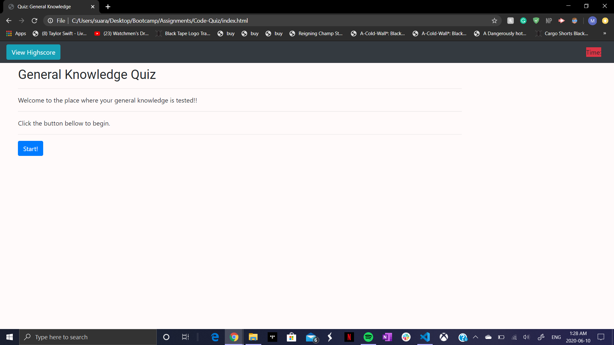
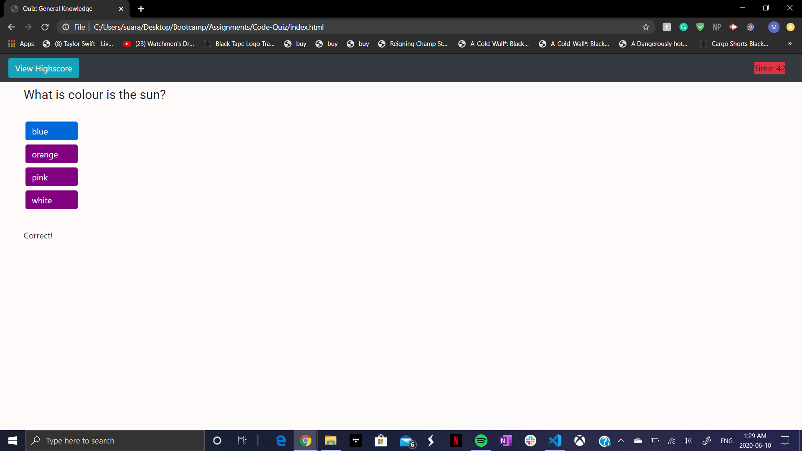
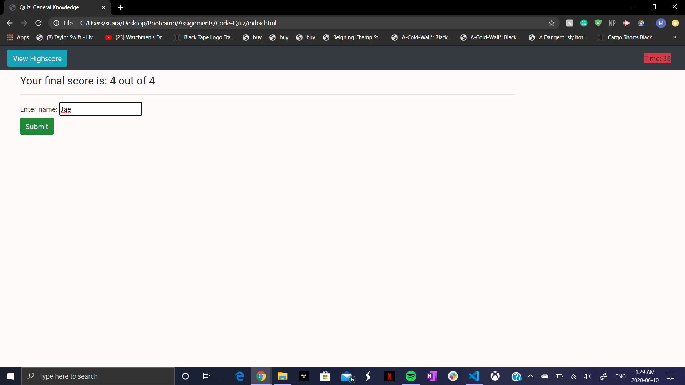
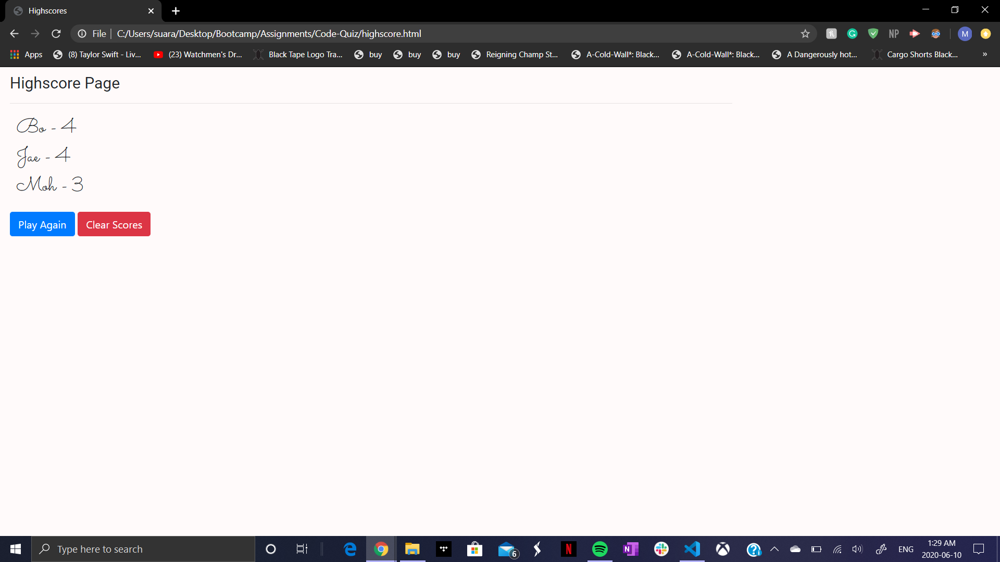

# 04 Web APIs: Code Quiz

As you proceed in your career as a web developer, you will probably be asked to complete a coding assessment, which is typically a combination of multiple-choice questions and interactive challenges. Build a timed code quiz with multiple-choice questions. This app will run in the browser and feature dynamically updated HTML and CSS powered by your JavaScript code. It will also feature a clean and polished user interface and be responsive, ensuring that it adapts to multiple screen sizes.

## Rules
- One correct question is 1 point
- A wrong answer leads to a 5sec deduction from the timer
- Quiz ends when the timer is up

## Start Page

## Question Page

## Submit page

## HighScore page

## Quiz Link
https://mohammedyasirsuara.github.io/Code-Quiz/